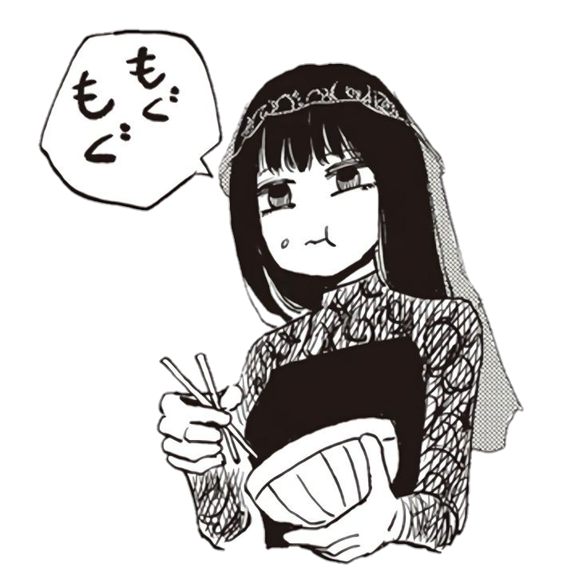

<h1 align="center">
	<p>
</h1>

<br>
<p align="center">
	<a href="https://saweria.co/neekoi"></a>
	<br><br>
	<b>🙌 Use <a href="https://saweria.co/neekoi">donations</a> to help support <b>my</b> projects! 🙌</b>
</p>
<br>

---

<p align="center">
	<sub>Join <a href="https://yourdonation.rocks"><code>Group Bot</code></a> untuk liat fitur lengkapnya. Jangan lupa cek <a href="https://nikolaskama.me">bio</a> dan subscribe <a href="https://youtube.com/qyuunee">YouTube</a>.</sub>
</p>

<br>

## Osaragi V3.0 ✨
- AI
- Downloader
- Tools
- Group Security
- Searching
- **NO ENC 100%**

## WAJIB DIBACA SEBELUM INSTALL
- Pergi ke folder [all/security/adiwConfig.js](https://github.com/OxBrutal/Osaragi-V2.0/blob/main/all/security/adiwConfig.js)
- Ubah 'num' pake nomor owner kamu
- Approve gunakan kata **( oke )**

## HEROKU BUILDPACK

```
> heroku/nodejs
> https://github.com/jonathanong/heroku-buildpack-ffmpeg-latest
> https://github.com/clhuang/heroku-buildpack-webp-binaries.git
```
